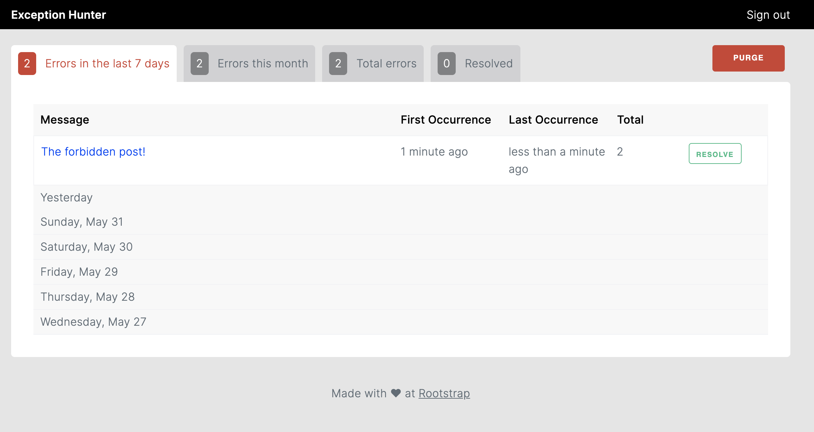

# ExceptionHunter


[](https://codeclimate.com/github/rootstrap/exception_hunter/maintainability)
[](https://codeclimate.com/github/rootstrap/exception_hunter/test_coverage)



Exception Hunter is a Rails engine meant to track errors in your Rails project. It works
by using your Postgres database to save errors with their corresponding metadata (like backtrace
or environment data at the time of failure).

To do so we hook to various points of your application where we can rescue from errors, track and
then re-raise those errors so they are handled normally. As such, the gem does not conflict with any
other service so you can have your favorite error tracking service running in parallel with Exception Hunter
while you decide which you like best.

## Motivation

Error tracking is one of the most important tools a developer can have in their toolset. As such
we think it'd be nice to provide a way for everyone to have it in their project, be it a personal
project, and MVP or something else.

## Installation
Add Exception Hunter to your application's Gemfile:

```ruby
gem 'exception_hunter', '~> 0.4.1'
```

You may also need to add [Devise](https://github.com/heartcombo/devise) to your Gemfile
if you haven't already done so and plan to use the gem's built in authentication:

```ruby
gem 'devise'
```

After installing the dependencies you'll want to run:

```bash
$ rails generate exception_hunter:install
```

This will create an initializer and invoke Devise to
create an `AdminUser` which will be used for authentication to access the dashboard. If you already
have this user created ([ActiveAdmin](https://github.com/activeadmin/activeadmin) uses the same model)
you can run the command with the `--skip-users` flag.

Additionally it should add the 'ExceptionHunter.routes(self)' line to your routes, which means you can go to
`/exception_hunter/errors` in your browser and start enjoying some good old fashioned exception tracking!

## Stale data

You can get rid of stale errors by running the rake task to purge them:

```bash
$ rake exception_hunter:purge_errors
```

We recommend you run this task once in a while to de-clutter your DB, using a recurring tasks once
a week would be ideal. You can also purge errors by running `ExceptionHunter::ErrorReaper.purge`.

The time it takes for an error to go stale defaults to 45 days but it's configurable via the initializer.

## License
The gem is available as open source under the terms of the [MIT License](https://opensource.org/licenses/MIT).

## Credits

Exception Hunter is maintained by [Rootstrap](http://www.rootstrap.com) with
the help of our [contributors](https://github.com/rootstrap/exception_hunter/contributors).

[](http://www.rootstrap.com)
