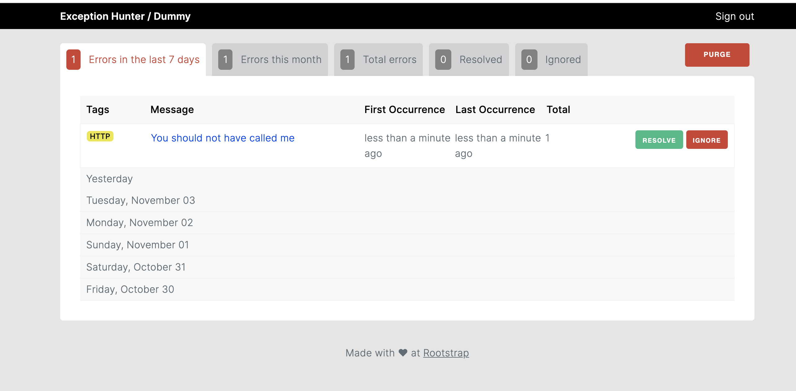

# ExceptionHunter


[](https://codeclimate.com/github/rootstrap/exception_hunter/maintainability)
[](https://codeclimate.com/github/rootstrap/exception_hunter/test_coverage)



Exception Hunter is a Rails engine meant to track errors in your Rails project. It works
by using your Postgres database to save errors with their corresponding metadata (like backtrace
or environment data at the time of failure).

To do so we hook to various points of your application where we can rescue from errors, track and
then re-raise those errors so they are handled normally. As such, the gem does not conflict with any
other service so you can have your favorite error tracking service running in parallel with Exception Hunter
while you decide which you like best.

## Motivation

Error tracking is one of the most important tools a developer can have in their toolset. As such
we think it'd be nice to provide a way for everyone to have it in their project, be it a personal
project, and MVP or something else.

## Docs

You can check the full documentation at [https://rootstrap.github.io/exception_hunter]().

## Installation

Add Exception Hunter to your application's Gemfile:

```ruby
gem 'exception_hunter', '~> 1.0'
```

You may also need to add [Devise](https://github.com/heartcombo/devise) to your Gemfile
if you haven't already done so and plan to use the gem's built in authentication:

```ruby
gem 'devise'
```

After installing the dependencies you'll want to run:

```bash
$ rails generate exception_hunter:install
```

This will create an initializer and invoke Devise to
create an `AdminUser` which will be used for authentication to access the dashboard. If you already
have this user created ([ActiveAdmin](https://github.com/activeadmin/activeadmin) uses the same model)
you can run the command with the `--skip-users` flag.

Additionally it should add the 'ExceptionHunter.routes(self)' line to your routes, which means you can go to
`/exception_hunter/errors` in your browser and start enjoying some good old fashioned exception tracking!

#### Testing it on dev:

ExceptionHunter is disabled on dev by default so if you want to test it before shipping it to another
environment, which we highly recommend, you should enable it by going to the initializer and changing the
line that says `config.enabled = !(Rails.env.development? || Rails.env.test?)` with something like
`config.enabled = !(Rails.env.test?)` while you test. Don't forget to change it back if you don't
want a bunch of errors in your local DB!

You can then open a `rails console` and manually track an exception to check that it
works `ExceptionHunter.track(StandardError.new("It works!"))`. You should now see the exception
on [http://localhost:3000/exception_hunter]().

## Stale data

You can get rid of stale errors by running the rake task to purge them:

```bash
$ rake exception_hunter:purge_errors
```

We recommend you run this task once in a while to de-clutter your DB, using a recurring tasks once
a week would be ideal. You can also purge errors by running `ExceptionHunter::ErrorReaper.purge`.

The time it takes for an error to go stale defaults to 45 days but it's configurable via the initializer.

## Manual tracking

ExceptionHunter also includes a facility to manually log from anywhere in the code. Imagine the following case:

```ruby
case current_user.status
when :inactive then do_something
when :active then do_something_else
when :banned then do_something_else_else
else
  ExceptionHunter.track(ArgumentError.new('This should never happen'), custom_data: { status: current_user.status }, current_user: user)
end
```

In this scenario we don't really want to raise an exception but we might want to be alerted if by any chance a user
has an invalid status.

## Slack notifications

You can configure ExceptionHunter to send a message to slack every time an error occurs.
You have to do the following:

1. Create a Slack app.
2. Add it to your workspace.
3. Add one or more webhooks linked to the channels you want to receive the notifications.
4. Set the webhook urls in the `exception_hunter` initializer.

```ruby
config.notifiers << {
  name: :slack,
  options: {
    webhook: 'SLACK_WEBHOOK_URL_1'
  }
}

config.notifiers << {
  name: :slack,
  options: {
    webhook: 'SLACK_WEBHOOK_URL_2'
  }
}
```

5. Add the code below to the environment config file where you are using ExceptionHunter with the correct server url.

```ruby
ExceptionHunter::Engine.configure do |config|
  config.routes.default_url_options = { host: "your_server_url" }
end
```

This uses ActiveJob to send notification in the background, so [make sure you configure](https://guides.rubyonrails.org/active_job_basics.html#setting-the-backend) it with the adapter you are using, if not notifications will be sent synchronously.

## Async Logging

You can configure ExceptionHunter to log async when an error occurs.
You have to do the following:

```ruby
config.async_logging = true;
```

This uses ActiveJob to log the error in the background, so [make sure you configure](https://guides.rubyonrails.org/active_job_basics.html#setting-the-backend) it with the adapter you are using, if not the error will be logged synchronously.

## License

The gem is available as open source under the terms of the [MIT License](https://opensource.org/licenses/MIT).

## Credits

Exception Hunter is maintained by [Rootstrap](http://www.rootstrap.com) with
the help of our [contributors](https://github.com/rootstrap/exception_hunter/contributors).

[](http://www.rootstrap.com)
